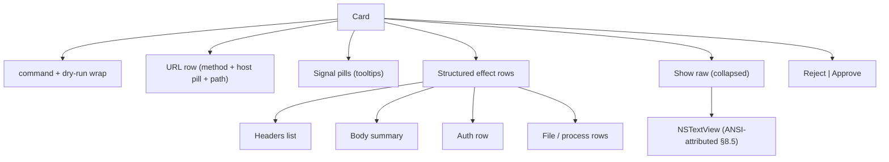
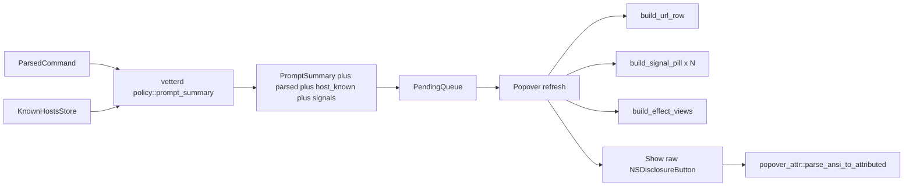

# Approval UI

Native AppKit catalogue for the macOS approver popover. This doc owns
the *shape* of each card: which widgets render which fields, how
severity colors are applied, what is intentionally deferred, and the
SGR-to-`NSColor` taxonomy shared with the CLI renderer (see
[Body colouring](#body-colouring)). For build / smoke / debug
procedures see [MacOSApp.md](MacOSApp.md).

## Goals

- **Scan in 2 seconds.** A glance at the card should answer "where is
  the agent reaching, and how scary is it?" before the user has to
  read any text.
- **Reuse, don't reinvent, the severity taxonomy.** Risk signals,
  badge colors, and the dry-run wrapper come straight from
  `vetter-core` so the popover and `vet --explain` stay in
  lockstep.
- **Fail closed on unknowns.** If a parser produces an effect we
  don't yet have a native widget for, the user can always click
  "Show raw" to see the §8.5 plaintext layout — every field stays
  reachable, even when the structured presentation is incomplete.
- **Keep the daemon agnostic.** All the UI rules live in
  `vetterd/src/runloop/popover_*.rs`. `vetter-core` only ships data
  (the parsed command, risk signals, severity classifier).

## Non-goals (v1)

- Click-to-pin pill detail popovers. Tooltips on hover are the only
  reasoning surface in v1; richer click affordances are tracked in
  the [Future work](#future-work) section.
- Per-query-param coloring or body-diff highlighting on mutating
  methods.
- Allowlist-pattern picker / "Allow this host" pill action.
- Replacing the §8.5 text body entirely. The new structured layout is
  *additive* in the sense that the raw text is always one click away
  through the per-card "Show raw" disclosure.

## Information hierarchy

Top-to-bottom of each card:

1. **Title strip** — `<command>` (and the dry-run `NSBox` wrapper
   when `force_prompt` is set). Owned by [`runloop::popover`](../vetterd/src/runloop/popover.rs);
   no change vs. the previous polish round.
2. **URL row** (HttpRequest effects only). Method badge + scheme +
   trust-colored host pill + port + path + query. See
   [URL row](#url-row).
3. **Pills row.** One tinted pill per distinct `Warn` / `Danger`
   `SignalKind`; tooltip carries the `RiskSignal::detail` string.
   `Info`-tier kinds intentionally don't render a pill — they're
   visible inside the "Show raw" disclosure only. See
   [Signal pills](#signal-pills).
4. **Structured effect rows.** One typed widget per item in
   `parsed.effects`: HTTP headers (with redaction), HTTP body
   (typed per `Body` variant), auth row, file read/write rows,
   process-spawn rows. See [Effect rows](#effect-rows).
5. **Show raw disclosure** (closed by default). Reveals the
   existing ANSI-translated `NSTextView` (the v1 body, powered by
   [`runloop::popover_attr`](../vetterd/src/runloop/popover_attr.rs)).
6. **Buttons.** Reject (left, destructive) and Approve (right,
   default with `Return` key equivalent). Behavior identical to the
   previous polish round.



## Element catalogue

### Tinted pill recipe

Used everywhere a small colored capsule is wanted (signal pills, host
pill, future allowlist chips). Implemented in
[`runloop::popover_pills`](../vetterd/src/runloop/popover_pills.rs)
as `build_pill(label, fg, bg, mtm)`.

- Build an `NSTextField::labelWithString(label, mtm)`.
- `setBezeled(false)`, `setBordered(false)`, `setDrawsBackground(true)`.
- `setBackgroundColor(bg)`, `setTextColor(fg)`,
  `setFont(boldSystemFontOfSize(10.0))`.
- `setWantsLayer(true)`; set `layer.cornerRadius = 7.0` AND
  `layer.masksToBounds = true` so the rounded geometry actually
  clips the underlying `NSTextField` cell background — without
  `masksToBounds` the corner rounding is invisible because the cell
  paints a rectangular fill that overlaps the rounded layer edges.
- Add small horizontal padding by inserting two
  `NSTextField`-friendly invisible "  " spaces around the label
  (cheaper than building an `NSView` subclass).
- Backgrounds are computed by `pill_bg_for(fg)` =
  `fg.colorWithAlphaComponent(0.22)`. The popover's appearance is
  pinned to `NSAppearanceNameDarkAqua` (see "Popover appearance"
  below), so a low-alpha tint of the foreground reads as a soft
  capsule on a dark surface in both Light and Dark system themes.

### Popover appearance

`Popover::new` calls
`popover.setAppearance(NSAppearance::appearanceNamed(NSAppearanceNameDarkAqua))`
on both the popover and the root container view. We pin the
appearance instead of inheriting from the system theme because the
pill / signal / URL row colours were calibrated against a dark
surface; running them under Light Aqua made the orange / yellow
text unreadable regardless of pill background. Pinning gives one
visual story to QA against and keeps the design doc honest.

### Signal pills

Per [`SignalKind::ui_severity`](../vetter-core/src/signals/mod.rs):

| Severity | Foreground | Background |
|---|---|---|
| `Danger` | `systemRedColor` | `pill_bg_for(systemRedColor)` |
| `Warn` | `systemOrangeColor` | `pill_bg_for(systemOrangeColor)` |
| `AuthHeader` (special-cased) | `systemGreenColor` | `pill_bg_for(systemGreenColor)` |
| `Info` | (no pill — body line only) |  |

`AuthHeader` overrides the generic `Warn → orange` mapping to a
positive-signal green: an Authorization header on a request means
the agent already has credentials (and we redacted them on the way
in), which is a different story than the orange "watch out" pills
the rest of the Warn tier carries.

Tooltip text: `format!("{slug}: {detail}")`, where `slug` is
[`signal_kind_label(kind)`](../vetter-core/src/render/mod.rs) (e.g.
`auth-header`, `insecure-tls`, `pipe-to-shell`) and `detail` is the
`RiskSignal::detail` string the analyzer emitted. The same slugs
appear on the body's `Risk signals:` line, so a user learning the
taxonomy on one surface recognises it on the other.

Font is the pill recipe's `boldSystemFontOfSize(10.0)` — small enough
to fit several chips next to a wide URL header.

Pills dedupe by `SignalKind` (one chip per kind, even when multiple
effects emit the same kind) so a multi-effect request doesn't
bury the rest of the card under near-identical pills. The detail
string used for the tooltip is the *first* matching signal's detail
— good enough for v1; future work could merge multiple details.

`Info`-tier signals are intentionally **not** chipped; they live in
the body's `Risk signals:` line only. Anything new added to
`SignalKind` defaults to no chip until its `ui_severity` is
explicitly raised to `Warn` or `Danger`.

### URL row

`build_url_row(req, host_known, mtm)` in
[`runloop::popover_url`](../vetterd/src/runloop/popover_url.rs).

Layout: horizontal `NSStackView`, monospaced 13pt, semibold for the
method badge.

```
[GET] https:// [api.example.com] :8080 /v1/things ?q=1
```

Token rules:

| Token | Style |
|---|---|
| Method badge | Bold colored label, palette = `Style::Method(*)` (GET green, POST/PUT/PATCH yellow, DELETE red, other magenta). |
| `scheme://` | `secondaryLabelColor` |
| Host pill | Loopback → grey on `quaternaryLabelColor`. `host_known` → `systemGreenColor` on tinted green. Unknown → `systemOrangeColor` on tinted orange. Tooltip on hover names the trust class ("known host", "unknown host", "loopback"). |
| `:port` | `systemOrangeColor` if non-standard (not 80/443/8080/8443), otherwise omitted. |
| Path | Monospaced regular, default color. |
| Query | Monospaced `secondaryLabelColor`. Per-param coloring is deferred. |

For non-HttpRequest cards (`ProcessSpawn`-only, future kinds) the URL
row falls back to a simple `<verb> <target>` label so the slot is
always populated.

### Effect rows

`build_effect_views(parsed, mtm) -> Vec<NSView>` in
[`runloop::popover_effects`](../vetterd/src/runloop/popover_effects.rs).

Per `Effect`:

- **`HttpRequest`**:
  - **Headers.** Vertical `NSStackView`. Each row is `name: value` —
    name in `systemBlueColor` (the existing `HeaderName` style),
    value monospaced regular. Secret headers
    (per [`vetter_core::render::is_secret_header`](../vetter-core/src/render/redact.rs))
    show the `••••<last-4>` redaction recipe in `systemRedColor`
    plus a dim "← redacted, len N" suffix.
  - **Body.** Typed cell:
    - `Body::None` → row omitted entirely.
    - `Body::Inline { bytes }` → meta line `"<content-type>, N B"`
      in dim, plus the bytes (UTF-8 if decodable, hex dump otherwise)
      in a monospaced label.
    - `Body::FromFile { path }` → file glyph (SF Symbol `doc.text`) +
      path label.
    - `Body::FromStdin { digest, len }` → "from stdin, N B, sha256
      <digest>" in dim.
    - `Body::Form { fields }` → "x-www-form-urlencoded, N fields" +
      a vertical sub-stack of `key=value` rows (values currently
      shown in plain; future work could redact known sensitive keys).
  - **Auth.** Single row, `RedactedHeader` color when redacted
    (Bearer/Basic/named-header), neutral otherwise (`Netrc`).
- **`FileRead`**: SF Symbol `doc.text` + monospaced absolute path.
- **`FileWrite`**: SF Symbol `square.and.pencil` + monospaced
  absolute path.
- **`ProcessSpawn`**: SF Symbol `terminal` + monospaced command
  string.
- **`CredentialUse`**, **`Network`**: skipped (the §8.5 layout
  doesn't render them either).

SF Symbols are sourced via
`NSImage::imageWithSystemSymbolName_accessibilityDescription`; if a
particular symbol is unavailable on the running OS we omit the icon
and just show the label (the system call returns an empty image
rather than crashing).

### Show raw disclosure

Per-card `NSDisclosureButton` (`NSBezelStyle::Disclosure`,
`NSButtonType::PushOnPushOff`) titled "Show raw". Toggling the
button hides/unhides the `body_scroll` (the same scrollable
`NSTextView` the previous polish round used, fed by
[`runloop::popover_attr::parse_ansi_to_attributed`](../vetterd/src/runloop/popover_attr.rs)).
Default state: collapsed. The `NSTextView` is built lazily on first
expand to keep the closed-state card cheap.

This is the safety valve: any time the structured layout hasn't
caught up with a new parser, "Show raw" guarantees the user can
still read the canonical §8.5 detail before approving.

### Body colouring

The "Show raw" disclosure paints the §8.5 layout as an
`NSAttributedString`. The daemon emits SGR escapes via
[`vetter_core::render::AnsiWriter`](../vetter-core/src/render/mod.rs);
the popover parses them back and stamps `NSColor` attributes. The
mapping mirrors `ansi_for` 1:1 so `vet --explain` and the popover
read identically — this taxonomy is the contract between the CLI
renderer and the AppKit body.

| `Style` (vetter-core) | SGR | `NSColor` (popover) |
|---|---|---|
| `Header` | `1` (bold) | label, bold monospaced |
| `RuleLine`, `BodyMeta`, `Badge(Info)` | `90` (bright-black) | `secondaryLabelColor` |
| `Method(Read)` (GET/HEAD) | `1;32` | `systemGreenColor`, bold |
| `Method(Write)` (POST/PUT/PATCH) | `1;33` | `systemYellowColor`, bold |
| `Method(Delete)` | `1;31` | `systemRedColor`, bold |
| `Method(Other)` | `1;35` | `systemPurpleColor`, bold |
| `HeaderName` | `94` (bright-blue) | `systemBlueColor` |
| `RedactedHeader` | `31` | `systemRedColor` |
| `Url` | `4;36` | `systemTealColor` + underline |
| `Loopback` | `2;36` (cyan dim) | `secondaryLabelColor` |
| `Badge(Warn)`, `SignalText`, `MatchNone` | `33` | `systemYellowColor` |
| `Badge(Danger)`, `MatchDeny` | `1;31` | `systemRedColor`, bold |
| `MatchOk` | `32` | `systemGreenColor` |

Unknown SGR codes fall through unstyled — the parser is intentionally
permissive so a future widening of `ansi_for` doesn't crash the
popover (it just drops colour until the parser catches up).

### Dry-run wrapper

`PromptSummary.force_prompt` (set when `vet --dry-run` was used)
swaps the bare card layout for an `NSBox` wrapper:

- `NSBoxType::Custom`, `borderColor = systemYellowColor`,
  `borderWidth = 1.5`, `cornerRadius = 6.0`.
- `titlePosition = AtTop`, `title = "dry run"`.
- The previous inline `dry run` `secondaryLabelColor` pill in
  `header_row` is removed — the box title carries the message.

Non-dry-run cards stay bare so the visual contrast between the two
classes reads at a glance when both sit in the same popover.

### Card chrome

- Outer `CARD_SPACING = 16.0` (was 12) plus
  `NSBoxType::Separator` rules between adjacent cards.
- Each card stack carries `NSEdgeInsets` of `12, 12, 12, 12` so the
  body view doesn't clip against the dry-run box border.
- Header text uses `monospacedSystemFontOfSize_weight(13.0,
  NSFontWeightSemibold)` so the verb / URL on the header reads in
  lockstep with the body's monospaced font.

### Approve / Reject buttons

- Layout: **Reject** on the left, **Approve** on the right (canonical
  macOS HIG for accept/cancel pairs).
- **Approve** gets `setKeyEquivalent("\r")` → promotes it to the
  system default button (accent-tinted, accepts `Return`).
- **Reject** gets `setHasDestructiveAction(true)` → red tint on
  macOS 11+, plus AppKit's accidental-press guard. Older systems
  silently fall back to a regular bezel.
- `Esc` is **not** rebound: the popover's `Transient` behavior
  reserves it for dismissal, so the user can always back out without
  resolving a card.

## Data flow



`PromptSummary` carries:

- `id`, `command`, `primary_verb`, `primary_target`, `force_prompt`
  (unchanged from PR 2 of Phase 4).
- `signals: Vec<RiskSignal>` — full risk records (was
  `Vec<SignalKind>`); the `detail` field powers tooltips.
- `parsed: Option<ParsedCommand>` — present on prompt-class
  requests; absent on legacy / mock callers, in which case the
  popover degrades to "URL row from `primary_target` + raw
  disclosure only".
- `host_known: Vec<bool>` — parallel to `parsed.effects`; entry `i`
  is `true` iff that effect is a `HttpRequest` whose host matched
  the daemon's `KnownHostsStore` (loopback also counts as known).

All new fields are `#[serde(default)]` so the wire format stays
forward-compatible.

## Future work

In rough priority order:

1. **Click-to-pin pill detail popover.** Replace the tooltip-only
   reasoning with an `NSPopover` (`Semitransient` behavior) anchored
   to the pill, holding the slug + a longer paragraph explaining
   "why is this flagged" plus a future "Allow this …" button.
2. **Per-param query coloring.** The `build_query_summary` slot in
   the URL row leaves room to highlight known-sensitive query keys
   (`api_key=`, `token=`, ...) the way headers are already redacted.
3. **Mutating-method body diff.** For PATCH/PUT, show a structural
   diff cell instead of a raw bytes dump.
4. **Allowlist-pattern picker.** A "Generalise…" button that opens
   a sheet with proposed YAML rules to add to the allowlist.
5. **Project trust classes.** Beyond binary known/unknown, model
   "this is the project's own host" vs. "this is a third-party
   known host" so the pill can reflect more than two states.

Each item is small enough to land in its own PR without rearranging
the catalogue here; the "Show raw" disclosure means we can ship
incremental improvements without ever stranding a parser surface.
